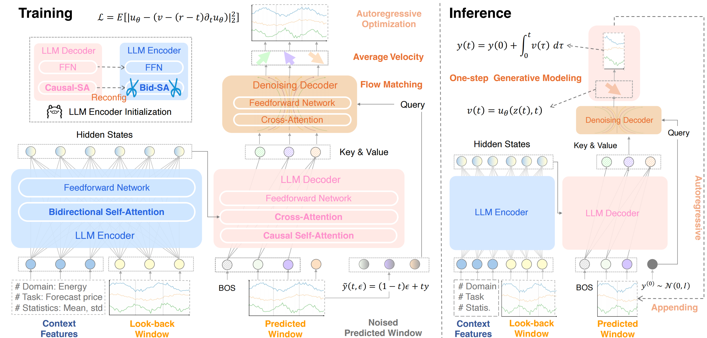
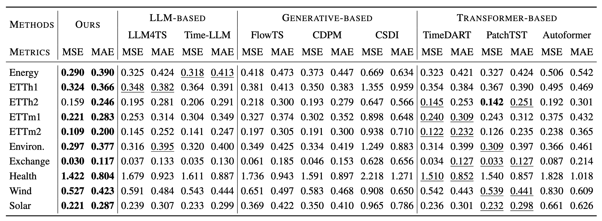

<h1 align="center">CoGenCast: A Coupled Autoregressive-Flow Generative Framework for Time Series Forecasting</h1>
<p align="center">
  
  
  
</p>

## 📝 Abstract
In this work, we propose CoGenCast, a hybrid generative framework that couples pre-trained LLMs with flow-matching mechanism for effective time series forecasting. This repository contains the official code for our [paper](https://arxiv.org/abs/2602.03564).

<details>
  <summary><b>Full Abstract</b></summary>

  Time series forecasting can be  viewed as a generative problem that requires both semantic understanding over contextual conditions and stochastic modeling of continuous temporal dynamics. Existing approaches typically rely on either autoregressive large language models (LLMs) for semantic context modeling or diffusion-like models for continuous probabilistic generation. However, neither method alone can adequately model both aspects simultaneously. In this work, we propose CoGenCast, a hybrid generative framework that couples pre-trained LLMs with flow-matching mechanism for effective time series forecasting. Specifically, we reconfigure  pre-trained decoder-only LLMs into a  native forecasting encoder–decoder backbone by modifying only the attention topology, enabling bidirectional context encoding and causal representation generation. Building on this, a flow-matching mechanism  is further integrated to model temporal evolution, capturing continuous stochastic dynamics conditioned on the autoregressively generated representation. Notably, CoGenCast naturally supports multimodal forecasting and cross-domain unified training. Extensive experiments on multiple benchmarks show that CoGenCast consistently outperforms previous compared baselines. 
</details>

## 🖼️ Overview

- Figure 1. Overview of our proposed CoGenCast. **Left (Training)**: We reconfigure decoder-only LLMs into an encoder–decoder backbone
by attention-only modification, and perform continuous flow-matching mechanism conditioned on the LLM-generated representation.
**Right (Inference)**: Future patches are generated autoregressively and sampled via one-step flow-matching generation with low-latency. 

## ✨ Key Features
- Problem Reformulation: We highlight that an ideal  forecasting approach should possess dual capabilities: semantic understanding over contextual conditions and stochastic modeling of continuous temporal dynamics.
- Architecture Innovation: We propose CoGenCast, a hybrid generative framework that couples pre-trained LLMs with continuous flow-matching mechanism for  time series forecasting.
- Empirical Superiority: CoGenCast consistently outperforms previous methods in forecasting across multiple benchmarks.

## 🚀 Quick Start
### Environment
- Python 3.10 (recommended)
```bash
conda create cogencast python=3.10
conda activate cogencast
```
- Install dependencies
```bash
pip install -r requirements.txt
pip install transformers
```

### Datasets and LLM Backbone
#### Datasets
We use the following five real-world datasets for our experiments. They are placed in the ./datasets folder in the repository. Please ensure you adhere to each dataset's respective license when using them.
- ETT: Available at [Informer: Beyond Efficient Transformer for Long Sequence Time-Series Forecasting](https://cdn.aaai.org/ojs/17325/17325-13-20819-1-2-20210518.pdf).
- Enery、Environment、Health: Available at [Time-MMD: Multi-Domain Multimodal Dataset for Time Series Analysis](https://proceedings.neurips.cc/paper_files/paper/2024/file/8e7768122f3eeec6d77cd2b424b72413-Paper-Datasets_and_Benchmarks_Track.pdf).
- Exchange: Available at [Autoformer: Decomposition Transformers with Auto-Correlation for Long-Term Series Forecasting](https://ise.thss.tsinghua.edu.cn/~mlong/doc/Autoformer-nips21.pdf).
- Wind: Available at [Generative Time Series Forecasting with Diffusion, Denoise, and Disentanglement](https://proceedings.neurips.cc/paper_files/paper/2022/file/91a85f3fb8f570e6be52b333b5ab017a-Paper-Conference.pdf).
- Solar: Available at [Modeling Long- and Short-Term Temporal Patterns with Deep Neural Networks](Modeling Long- and Short-Term Temporal Patterns with Deep Neural Networks).
#### Backbone
Download the Qwen3-0.6B weights from [Hugging Face](https://huggingface.co/) and set the local path via `--llm_path`.

### Run Demo
```bash
cd CoGenCast
sh scripts/ETTh1.sh
```

## 📊 Performance


## 🙏 Acknowledgement
This repo is built on the pioneer works. We appreciate the following GitHub repos a lot for their valuable code base or datasets:
- [Time-Series-Library](https://github.com/thuml/Time-Series-Library)  [LLM4TS](https://github.com/blacksnail789521/LLM4TS)
  [Time-LLM](https://github.com/KimMeen/Time-LLM)
  [FlowTS](https://github.com/UNITES-Lab/FlowTS)
  [CDPM](https://github.com/zjt-gpu/CDPM)
  [CSDI](https://github.com/ermongroup/CSDI)
  [TimeDART](https://github.com/Melmaphother/TimeDART)
  [PatchTST](https://github.com/yuqinie98/PatchTST)
  
## 📌 Citation
> 🙋 Please let us know if you find any mistakes or have suggestions.
>
> ⭐ If you find our work helpful, please consider starring this repository and citing our research.
